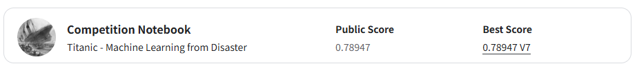
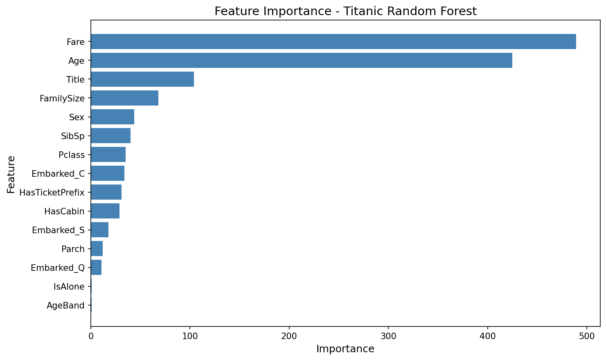

# 🚢 Titanic - Machine Learning from Disaster

> Kaggle 入门项目 | 使用随机森林预测泰坦尼克号乘客生存率


## 📊 项目成果

| 版本 | 描述 | 分数 |
|------|------|------|
| V1 | 初始版本 | 74.16% |
| V2 | 修复 Age/Fare 填充不一致 | 75.60% |
| V3 | 添加 HasCabin + 调参 | 78.95% |
| **V7** | **最终版本** | **78.947%** |

> 🎯 最终成绩：**Kaggle Public Leaderboard Top 15%**

## 📁 项目结构

```
titanic-github/
├── README.md                   # 项目介绍
├── titanic_analysis.py         # 完整代码
├── requirements.txt            # 依赖
├── data/                       # 数据目录 (需要下载)
│   ├── train.csv
│   └── test.csv
├── images/                     # 分析图表
│   ├── feature_importance.png  # 特征重要性图
│   └── kaggle-score.png        # Kaggle 分数截图
└── notebooks/                 # Jupyter Notebook 版本
    └── titanic.ipynb
```

## 📸 效果展示

### Kaggle 提交分数


### 特征重要性


最重要的特征：
1. **Sex** - 性别
2. **Pclass** - 舱位等级
3. **Fare** - 票价
4. **Title** - 称谓
5. **Age** - 年龄

## 🔍 分析思路

### 1. 数据探索

```python
# 快速了解数据
train.info()
train.describe()
train.isnull().sum()
```

**发现的问题：**
- Age 缺失 177 个 (~20%)
- Cabin 缺失 687 个 (~77%)
- Embarked 缺失 2 个

### 2. 特征工程

| 特征 | 创建方法 | 作用 |
|------|----------|------|
| `Title` | 从 Name 提取称谓 | Mr/Miss/Mrs/Master/Rare |
| `FamilySize` | SibSp + Parch + 1 | 家庭规模 |
| `IsAlone` | FamilySize == 1 | 是否独自出行 |
| `AgeBand` | 分段 [0-12, 12-18, 18-35, 35-60, 60+] | 年龄分组 |

### 3. 关键发现

```
女性生存率: 74.2%
男性生存率: 18.9%
```

**性别是最强的预测因素！**

### 4. 数据清洗

```python
# ⚠️ 关键：必须用 train 的统计量填充 test
age_median = train['Age'].median()  # 28.0
fare_median = train['Fare'].median()  # 14.45

train['Age'] = train['Age'].fillna(age_median)
test['Age'] = test['Age'].fillna(age_median)  # 用 train 的！

train['Fare'] = train['Fare'].fillna(fare_median)
test['Fare'] = test['Fare'].fillna(fare_median)
```

### 5. 模型选择

最终使用 **Random Forest**：

```python
from sklearn.ensemble import RandomForestClassifier

model = RandomForestClassifier(
    n_estimators=100,
    random_state=42
)
```

### 6. 交叉验证

使用 `StratifiedKFold` 确保每折的正负样本比例一致：

```python
from sklearn.model_selection import StratifiedKFold

skf = StratifiedKFold(n_splits=5, shuffle=True, random_state=42)
scores = cross_val_score(model, X, y, cv=skf)

# 结果: 81.37% ± 1.25%
```

## 🔧 安装与运行

```bash
# 1. 克隆项目
git clone https://github.com/YOUR_USERNAME/titanic-ml.git
cd titanic-ml

# 2. 创建虚拟环境
python -m venv venv
source venv/bin/activate  # Linux/Mac
# 或
venv\Scripts\activate  # Windows

# 3. 安装依赖
pip install -r requirements.txt

# 4. 下载数据
# 从 Kaggle 下载 train.csv 和 test.csv 到 data/ 目录

# 5. 运行
python titanic_analysis.py
```

## 📝 踩过的坑

### ❌ 错误：Age/Fare 填充不一致

```python
# ❌ 错误做法
train['Age'] = train['Age'].fillna(train['Age'].median())  # 28.0
test['Age'] = test['Age'].fillna(test['Age'].median())     # 27.0 ← 不一致！

# ✅ 正确做法
age_median = train['Age'].median()  # 先算 train 的
train['Age'] = train['Age'].fillna(age_median)
test['Age'] = test['Age'].fillna(age_median)  # 用 train 的填充
```

**后果**：会导致 train/test 分布不一致，模型在 test 上表现差。

### ❌ 错误：模型集成效果更差

| 方法 | 分数 |
|------|------|
| 单模型 Random Forest | 78.95% |
| 4模型集成 (RF+GB+XGB+LGB) | 76.31% |

**原因**：树模型之间相关性太高，集成没有带来多样性，反而增加了过拟合风险。

## 📚 学习资源

- [Kaggle Titanic 竞赛主页](https://www.kaggle.com/competitions/titanic)
- [Scikit-learn 文档](https://scikit-learn.org/stable/)
- [随机森林算法详解](https://www.geeksforgeeks.org/random-forest-algorithm-in-python/)

## 🚀 后续优化方向

1. **更精细的 Age 填充** - 按 Pclass/Sex 分组填充
2. **Cabin 特征** - 提取舱位前缀 (A, B, C...)
3. **Ticket 前缀** - 分析票号前缀与舱位关系
4. **交互特征** - Pclass × Sex, Age × Pclass

## 📄 许可证

MIT License - 随意使用，但请注明来源

---
